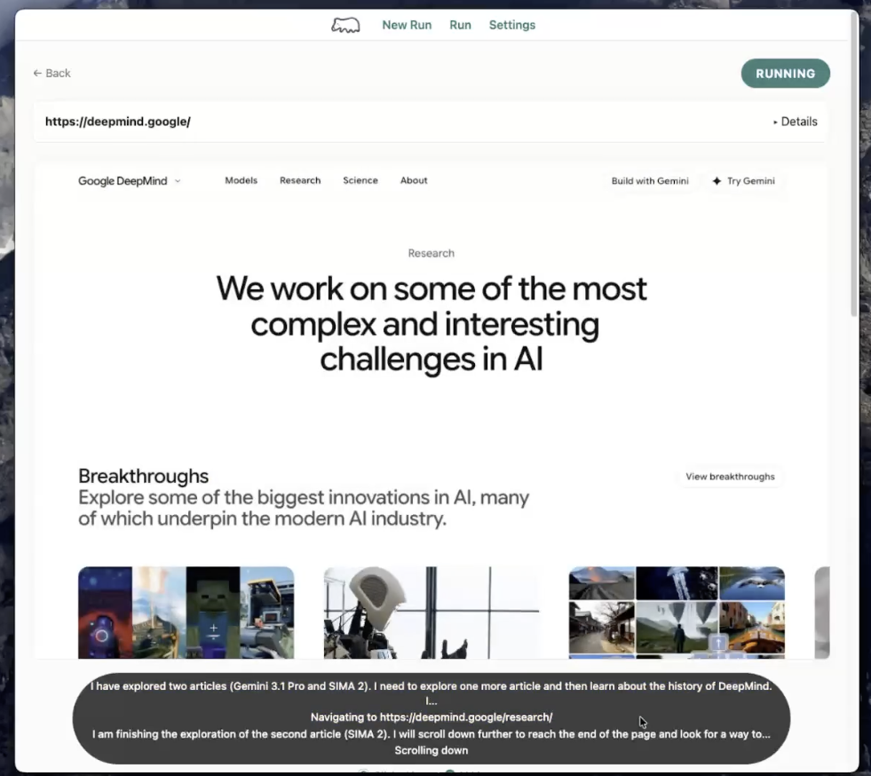
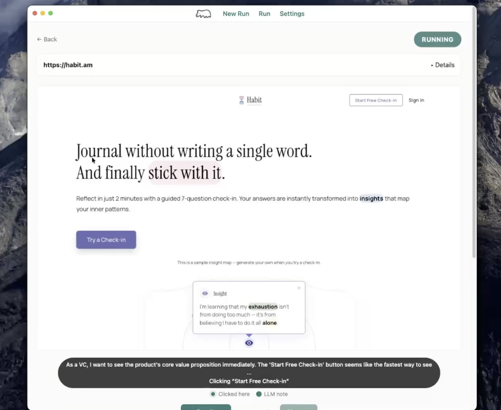
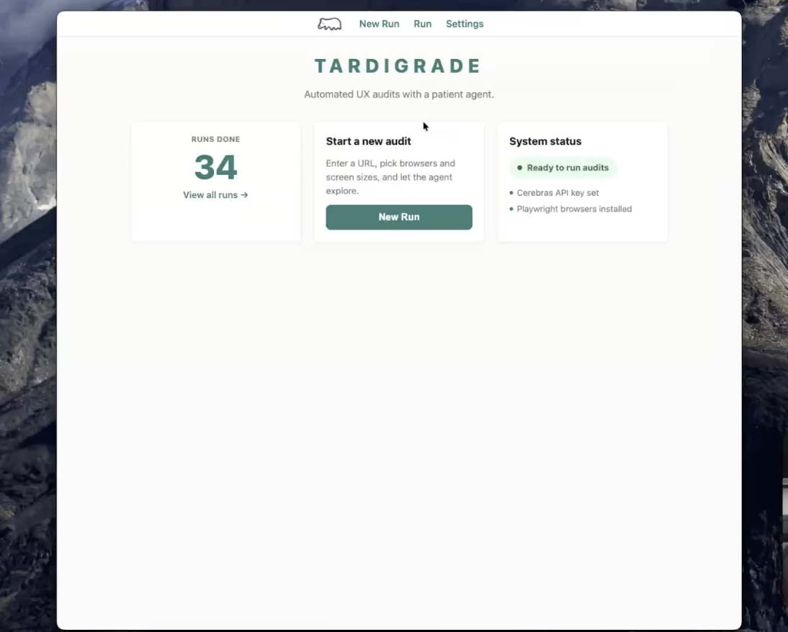

<p align="center">
  
</p>

<h1 align="center">Tardigrade</h1>

<p align="center">
  A synthetic user-testing / product auditor that drives a real browser, explores your web app like a user, and scores it against rubrics. Every take the agent has ties back to a screenshot, so you can see what UX is causing what reaction.
</p>

<p align="center">
  <picture><source media="(prefers-color-scheme: dark)" srcset="https://www.shieldcn.dev/github/stars/noemit/tardigrade.svg?variant=secondary&size=xs&mode=dark&theme=slate&font=fira-code"></picture>
  <picture><source media="(prefers-color-scheme: dark)" srcset="https://www.shieldcn.dev/github/forks/noemit/tardigrade.svg?variant=secondary&size=xs&mode=dark&theme=slate&font=fira-code"></picture>
  <picture><source media="(prefers-color-scheme: dark)" srcset="https://www.shieldcn.dev/github/watchers/noemit/tardigrade.svg?variant=secondary&size=xs&mode=dark&theme=slate&font=fira-code"></picture>
  <picture><source media="(prefers-color-scheme: dark)" srcset="https://www.shieldcn.dev/github/branches/noemit/tardigrade.svg?variant=ghost&size=xs&mode=dark&theme=slate&font=fira-code"></picture>
  
</p>

<p align="center">
  <picture><source media="(prefers-color-scheme: dark)" srcset="https://www.shieldcn.dev/github/last-commit/noemit/tardigrade.svg?variant=secondary&size=xs&mode=dark&theme=slate&font=fira-code"></picture>
  <picture><source media="(prefers-color-scheme: dark)" srcset="https://www.shieldcn.dev/github/commits/noemit/tardigrade.svg?variant=secondary&size=xs&mode=dark&theme=slate&font=fira-code"></picture>
  <picture><source media="(prefers-color-scheme: dark)" srcset="https://www.shieldcn.dev/github/open-issues/noemit/tardigrade.svg?variant=secondary&size=xs&mode=dark&theme=slate&font=fira-code"></picture>
  <picture><source media="(prefers-color-scheme: dark)" srcset="https://www.shieldcn.dev/github/closed-issues/noemit/tardigrade.svg?variant=ghost&size=xs&mode=dark&theme=slate&font=fira-code"></picture>
  <picture><source media="(prefers-color-scheme: dark)" srcset="https://www.shieldcn.dev/github/open-prs/noemit/tardigrade.svg?variant=secondary&size=xs&mode=dark&theme=slate&font=fira-code"></picture>
  <picture><source media="(prefers-color-scheme: dark)" srcset="https://www.shieldcn.dev/github/closed-prs/noemit/tardigrade.svg?variant=ghost&size=xs&mode=dark&theme=slate&font=fira-code"></picture>
  <picture><source media="(prefers-color-scheme: dark)" srcset="https://www.shieldcn.dev/github/merged-prs/noemit/tardigrade.svg?variant=ghost&size=xs&mode=dark&theme=slate&font=fira-code"></picture>
</p>

<p align="center">
  <picture><source media="(prefers-color-scheme: dark)" srcset="https://www.shieldcn.dev/github/license/noemit/tardigrade.svg?variant=ghost&size=xs&mode=dark&theme=slate&font=fira-code"></picture>
  <picture><source media="(prefers-color-scheme: dark)" srcset="https://www.shieldcn.dev/badge/Language-TypeScript-3178C6.svg?logo=typescript&variant=branded&size=xs&mode=dark&theme=slate&font=fira-code"></picture>
  <picture><source media="(prefers-color-scheme: dark)" srcset="https://www.shieldcn.dev/badge/Package_mgr-npm-CB3837.svg?logo=npm&variant=branded&size=xs&mode=dark&theme=slate&font=fira-code"></picture>
  <picture><source media="(prefers-color-scheme: dark)" srcset="https://www.shieldcn.dev/badge/Monorepo-yes-2563eb.svg?variant=secondary&size=xs&mode=dark&theme=slate&font=fira-code"></picture>
</p>

Tardigrade uses a fast multimodal LLM to drive a real browser, explore web apps, and score them against built-in and custom rubrics. Point it at any OpenAI-compatible endpoint (OpenAI, Gemini, DeepSeek, Kimi, Cerebras, or a local server).

## Screenshots

<p align="center">
  
</p>

<p align="center"><em>A live audit in progress — the agent explores the page and narrates its reasoning step by step.</em></p>

<table>
  <tr>
    <td width="50%" valign="top">
      
      <p align="center"><em>Persona-driven exploration with click targets and per-step notes.</em></p>
    </td>
    <td width="50%" valign="top">
      
      <p align="center"><em>Home dashboard: run history and system status at a glance.</em></p>
    </td>
  </tr>
</table>

## What it does

1. You give Tardigrade a URL (a production site or something running on `localhost`).
2. It launches a real browser via Playwright and explores the app like a synthetic user.
3. It captures screenshots, DOM snapshots, console logs, and network errors for every step.
4. It scores the session against UX, functional, conversion, and custom rubrics.
5. It shows the results in an interactive dashboard: replay the session, inspect evidence, and review findings.

## Why this exists

Most AI QA tools are either:

- **Closed SaaS black boxes** that are easy to start but hard to customize.
- **Raw agent libraries** that can browse but leave you to build rubrics, evidence collection, reporting, and replay UI.

Tardigrade is opinionated about **rubrics and evidence**. The goal is to make synthetic user testing repeatable, shareable, and grounded in observable proof.

## Tech stack

| Layer | Choice | Reason |
|-------|--------|--------|
| UI | Electron + React + TypeScript | Cross-platform desktop app; can reach `localhost` targets cleanly |
| Backend runtime | Node.js / TypeScript | Same runtime as Electron; native Playwright and OpenAI-SDK support |
| Browser automation | Playwright | Multi-browser support, screenshots, traces, network, console |
| LLM | Any OpenAI-compatible endpoint | Bring your own provider/key; presets for OpenAI, Gemini, DeepSeek, Kimi, Cerebras |
| Database | SQLite | Zero infrastructure; local-first |
| Packaging | Electron-embedded backend | No Docker required for normal use |

## Status

This is an early MVP. Implemented so far:

- ✅ Electron + Node.js backend scaffold
- ✅ SQLite schema for runs, sessions, and findings
- ✅ Health and Playwright status endpoints
- ✅ Agent loop: screenshot + DOM snapshot → LLM JSON action → execute
- ✅ Built-in rubrics and evaluator
- ✅ Custom rubric prompt → JSON generation
- ✅ Session replay screenshot carousel
- ✅ Finding cards with evidence
- ✅ Settings screen (provider preset, base URL, API key, model, image usage, browser)
- ✅ Cost/usage tracking (tokens, LLM calls)
- ✅ Mock LLM mode for offline testing
- ✅ Example CLI script

See:

- [ARCHITECTURE.md](./ARCHITECTURE.md) — design decisions and intentions
- [ROADMAP.md](./ROADMAP.md) — milestones and future phases
- [TESTING.md](./TESTING.md) — how to develop and verify
- [PROMPTS.md](./PROMPTS.md) — LLM prompts and iteration notes
- [TROUBLESHOOTING.md](./TROUBLESHOOTING.md) — common issues and fixes

## Development

### Prerequisites

- Node.js 20+
- An API key for any OpenAI-compatible LLM provider (for live runs)
- Playwright browsers:
  ```bash
  npx playwright install chromium
  ```

### Install

```bash
npm install
```

### Configure

Tardigrade talks to any **OpenAI-compatible Chat Completions** endpoint, so you
can bring your own provider and key. Copy `.env.example` to `.env`:

```bash
cp .env.example .env
```

Edit `.env`:

```env
LLM_API_KEY=your-key-here
LLM_BASE_URL=https://api.openai.com/v1
LLM_MODEL=gpt-4o
```

Built-in provider presets (selectable in the Settings screen, all editable):

| Provider | Base URL | Example model | Vision |
|----------|----------|---------------|--------|
| OpenAI | `https://api.openai.com/v1` | `gpt-4o` | ✅ |
| Google Gemini | `https://generativelanguage.googleapis.com/v1beta/openai` | `gemini-2.5-flash` | ✅ |
| Cerebras | `https://api.cerebras.ai/v1` | `gemma-4-31b` | ✅ |
| DeepSeek | `https://api.deepseek.com/v1` | `deepseek-chat` | ⚠️ text-only |
| Kimi (Moonshot) | `https://api.moonshot.ai/v1` | `kimi-k2.7` | ⚠️ text-only |
| Custom / local | e.g. `http://localhost:11434/v1` | your model | depends |

> **Vision matters.** Tardigrade drives the agent from screenshots, so the model
> must be multimodal. OpenAI `gpt-4o` and Gemini flash models read images;
> DeepSeek's and Kimi's standard chat models are text-only and will fail on
> screenshots. Use a vision-capable model for real audits.

> The base URL must include the version path (e.g. `/v1`); the OpenAI client does
> not append it. A bare host such as `https://api.deepseek.com` is auto-upgraded
> to `/v1` for convenience.

#### Controlling token cost

Vision tokens dominate the cost of a run. The **Image usage** setting (Settings
screen, or `LLM_IMAGE_MODE` in `.env`) controls how many screenshots are sent to
the model:

| Mode | What it sends | Cost |
|------|---------------|------|
| `high` (default) | Full-detail screenshot every step | Highest, best accuracy |
| `balanced` | Low-detail screenshot every step | Cheaper, one image per action |
| `minimal` | Low-detail, only on the first step and after the page changes | Lowest |

This only affects images sent to the model; the per-second replay frames saved
to disk are unaffected.

Legacy `CEREBRAS_API_KEY` / `CEREBRAS_BASE_URL` / `CEREBRAS_MODEL` variables are
still honored as a fallback, so existing setups keep working without changes.

If port `3001` is already in use, set a different `BACKEND_PORT`.

You can also set the provider, base URL, key, and model in the app's
**Settings** screen; they are stored in `~/.tardigrade/config.json`.

### Run in dev mode

```bash
npm run dev
```

This starts the Vite dev server and opens the Electron window. The Electron main process also spawns the backend automatically.

### Test without an API key

Set `MOCK_LLM=true` to run the pipeline with deterministic placeholder actions and findings:

```bash
MOCK_LLM=true npm run dev
```

### Run a backend-only example

```bash
cd packages/backend
MOCK_LLM=true npm run example http://localhost:8000/sample.html default
```

## Project layout

```
tardigrade/
├── packages/
│   ├── backend/     # Express server, agent loop, evaluator, DB, rubrics
│   └── frontend/    # Electron + Vite + React UI
├── README.md
├── ARCHITECTURE.md
├── ROADMAP.md
├── TESTING.md
├── PROMPTS.md
├── TROUBLESHOOTING.md
```

## Contributing

Contributions are welcome — see [CONTRIBUTING.md](./CONTRIBUTING.md) for setup,
dev, and the checks CI runs.

## License

[MIT](./LICENSE) © noemit
